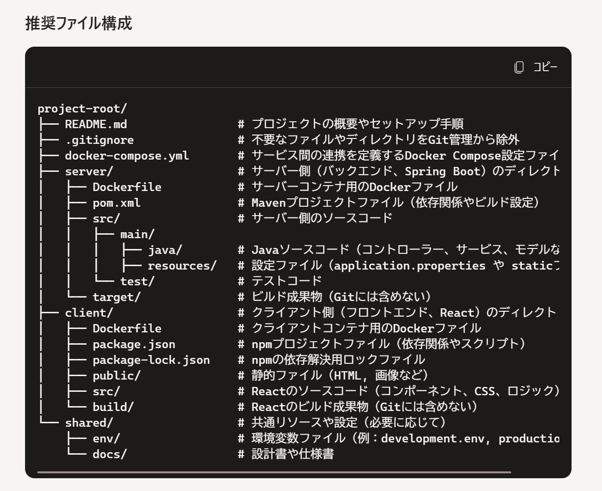

# 日記開発構想:方針とロードマップ
•テーマ
俺のための、日記サイト

•コンセプト
まずは小さく作ってから、大きくする
（最小単位で作成し、徐々に機能追加）

【フェーズ1】　
最低限動けばよし。ユーザーは分けずに、自分だけ使える想定
ログイン機能なし。

UI:あまり意識しない。ボタンやフォントは芋臭くていい。

①ホーム画面
•日記を作成ボタン（日付を押すとその日の入力を開始）
•入力履歴ボタン

②日記を作成（入力）
カレンダーから日付を選択してフォーマットを展開→その日にあったことを、テキスト形式で入力（文字のフォーマット選択はなし）
→完了ボタンを押すと、DBに保存される

③入力履歴（出力•削除）
入力履歴ボタンをクリック
→これまでに入力した日付とそれに紐付く日記が一覧形式で表示される

日記の右下にある削除ボタンから該当の日記の削除ができる

【フェーズ2】
ログイン機能追加。ユーザーごとに日記を管理できるようにする

UI:あまり意識しない。ボタンやフォントは芋臭くていい。

①新規登録画面（New!）
ユーザーID（任意の数字で登録、主キー）
名前（制約は未定、作りやすいのにする）
パスワード（数字とアルファベット8桁？）
→ユーザーテーブルに格納→手動でログイン画面に遷移

②ログイン画面（New!）
ユーザーIDとパスワードを入力し、ログイン
→セッション？にユーザーIDが引き渡される？
　（正しいか不明）

③ホーム画面
•日記を作成ボタン
•入力履歴ボタン
•マイページ(New!)
•ログアウトボタン（New!）

④ 日記を作成（入力）
カレンダーから日付を選択してフォーマットを展開→その日にあったことを、テキスト形式で入力（文字のフォーマット選択はなし）
→完了ボタンを押すと、DBに保存される

⑤ 入力履歴（出力）
これまでに入力した日付とそれに紐付く日記が一覧形式で表示される

日記の右下にある削除ボタンから該当の日記の削除ができる

⑥マイページ
ユーザー名が表示できる

⑦ログアウト（New!）→ボタンを押すと、ログイン画面に遷移（セッション？が切れる）

【フェーズ3】
日記に画像をアップロードして、保存できるようになる

①新規登録画面
ユーザーID（任意の数字で登録、主キー）
名前（制約は未定、作りやすいのにする）
パスワード（数字とアルファベット8桁？）
→ユーザーテーブルに格納→手動でログイン画面に遷移

②ログイン画面
ユーザーIDとパスワードを入力し、ログイン
→セッション？にユーザーIDが引き渡される？
　（正しいか不明）

③ホーム画面
•日記を作成ボタン
•入力履歴ボタン
•マイページ
•ログアウトボタン

④ 日記を作成
カレンダーから日付を選択してフォーマットを展開→その日にあったことを、テキスト形式で入力（文字のフォーマット選択はなし）
New! : 画像をローカルフォルダからアップロードすることができる
→完了ボタンを押すと、DBに保存される

⑤ 入力履歴（出力）
これまでに入力した日付とそれに紐付く日記（New! : 画像を含む）が一覧形式で表示される

日記の右下にある削除ボタンから該当の日記の削除ができる

⑥マイページ
ユーザー名が表示できる

⑦ログアウト→ボタンを押すと、ログイン画面に遷移（セッション？が切れる）

【フェーズ4】
UIを意識する。見やすくてスタイリッシュなデザインにしたい

アニメーションはなし。

MUIを使用。

【フェーズ5】
アニメーションを入れる。

（アイディア　現時点では実現性は不明）

•日記の投稿ボタンを押したときに、投稿ボタン周辺にアニメーションを発生させる
 Teamsの課題投稿時のようなイメージ
dockerとawsを用いた開発の学習

リポジトリ構成（co-pilotに出力してもらった）

